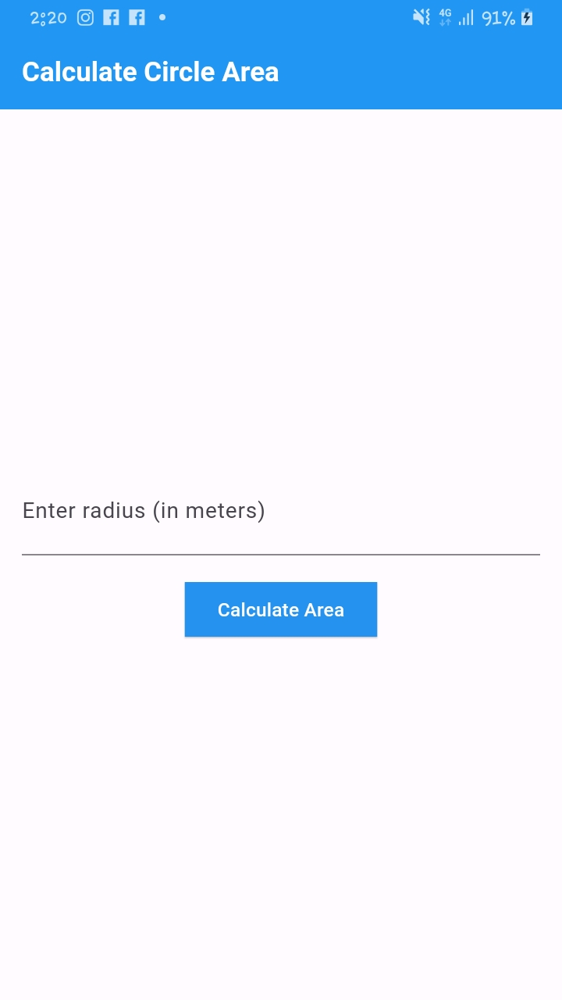
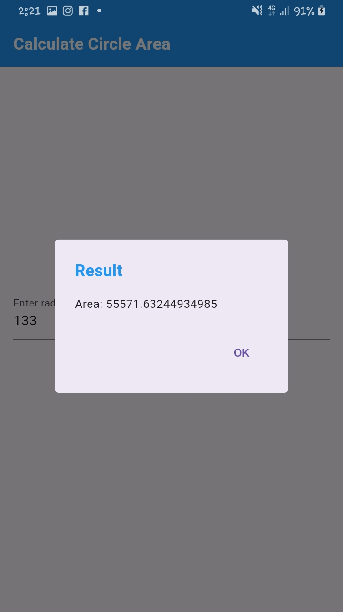

# MOBILE DEVELOPMENT WITH FLUTTER GROUP 14

## Project Target

- To develop a mobile application using flutter framework

## Project Tasks

- Learning Dart Programming Language
- Practicind Dart questions

---

## TASK O1 : AREA CIRCLE CALCULATOR APP

()
